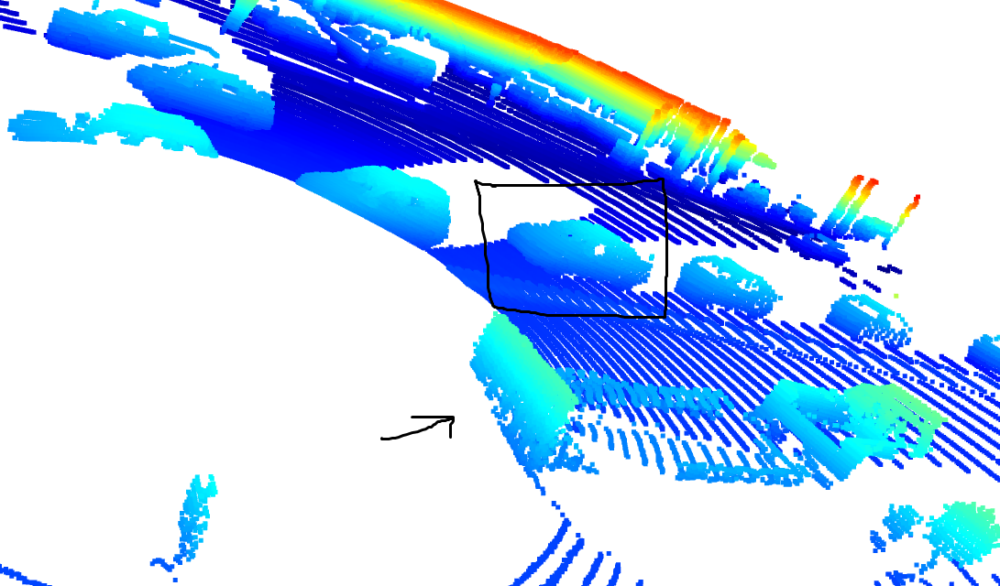
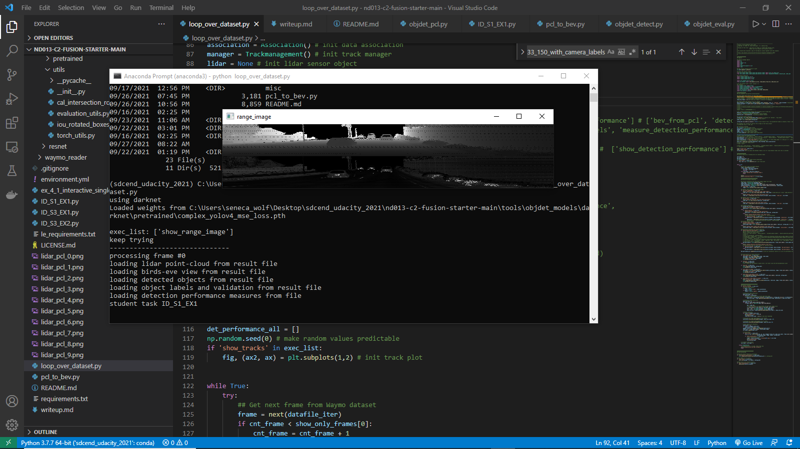

# ID_S1_EX2

Here I'll go through the rubric point by point but I'll start with the one that *we actually had to include in this writeup*, which
is "Visualize point-cloud (ID_S1_EX2)" (after that I'll go beginning to end in order): 
- "Visualize the point-cloud using the open3d module" 

> *Please note that this section has been re-written since my first submission as I have carefully addressed and elaborated
upon all points which a prior Professional Code Reviewer did not pass my project on* 

> Following are 10 images which were screenshots taken of different point clouds. 

 

I've drawn on the screenshot of the picture outputted by open3d as you can see above, in Paint. 
I surrounded a truck with a trailer on the back of it and drew arrows pointing at the rear tire 
as well as the bumper of the trailer. I've also drawn arrows alongside vehicles which are in opposing
traffic, so I've drawn arrows pointing in the direction that those vehicles are traveling. We can see the 
passenger side mirror / wing mirror encasement for certain on the closest vehicle to us in the opposing
traffic (and probably the second vehicle as well but it is more of an abstract painting on that one so
it is not as certain that that is what we are looking at on the second vehicle).  


The above was from frame 0 and this is frame 1. As can be seen, the same truck with a trailer on the back, so I've 
drawn another rectangle around it and an arrow pointing to one of the truck's tires. 

 

Here in the next frame we see again the side mirror / wing mirror on the far side of the nearest vehicle 
in opposing traffic (I've drawn an arrow in black in Paint pointing at it above). And, we see the same 
truck with the trailer as this is the very next frame, and the orientation of the truck and trailer makes
it clear where the bumper of the trailer is (I've drawn an arrow pointing at it) as well as some of the tires of 
the truck and trailer can be seen as well & I've drawn an arrow pointing at one of them.  

 

Here I've drawn an arrow at the truck / trailer's bumper, and a rectangle around that car with distinctive features 
in opposing traffic in the next lidar pointcloud frame. 

 

What I wanted to highlight in the next frame, above, is that a car in opposing traffic has many distinctive features
which can be very clearly seen. The windows, the shape of the car indicating which direction it is facing, the front 
driver's side tire, the rear driver's side tire. And once again I've drawn in black in Paint around the truck with its
trailer to keep our orientation as I'm dealing with these in successive frames at the beginning of the sequence 
of the 200 frames. 

  

Here I've highlighted (a.k.a. drawn around in black in Paint) a car in opposing traffic, and again, the same thing for
the truck & trailer which is clear again the orientation of it (i.e. where the bumper on the trailer is, the empty
bed of the truck, etc.). 


In the above picture I've drawn in black around the back of the trailer attached to the truck and around a car in opposing traffic. 
Here, I've rotated around in the open3d visualization of the lidar frame. So, you can see the orientation of the car in 
opposing traffic that it is right next to the truck with the trailer and going the opposite direction. Meanwhile, distinctive
features of the trailer can be seen again here (even though I've oriented it the opposite direction by dragging around
the open3d viewer window, so you might need to regain your orientation here--the trailer on the truck is to the left here and
the truck is out of view, the orientation is backwards from the above pictures because I wanted to show how clearly the 
orientation of that car which is alongside the truck with its trailer is in each of these frames; a video would make it easier to
follow along, otherwise we are relegated to English & pictures). 

 

In this picture again the truck with its trailer can be seen back to the usual orientation. This truck has quite a large
wing mirror / side mirror on the drivers side. In some of the other images it was hard to tell whether it was actually
the front tire or the wing mirror but here it is more clear that it is the side mirror. Again we can see the shape of the 
cars nearby in opposing traffic indicating the aerodynamics of them and which way they are facing. 

 

In the above the truck with the trailer is right in the center of the image and *facing* us. I've changed the orientation
again by dragging around the open3d viewer. You can see the back of the trailer. And, you can see that huge driver's side
wing mirror on the truck. You can also make out the orientation of the cars in opposing traffic. 

 

And in this last picture above we again see the truck with its trailer and its huge drivers side wing mirror, as well as 
the aerodynamics of the cars in opposing traffic indicating clearly their orientation.  


- "Find 10 examples of vehicles with varying degrees of visibility in the point-cloud" 
- "Try to identify vehicle features that appear stable in most of the inspected examples and describe them" 
- "Identify vehicle features that appear as a stable feature on most vehicles (e.g. rear-bumper, tail-lights) and describe them briefly. Also, use the range image viewer from the last example to underpin your findings using the lidar intensity channel."  

Because no features can be made out in the above images it isn't possible to fully satisfy this rubric point other than writing about it (like this). I'm honestly thinking that this is what was intended.  

# ID_S1_EX1 

I feel that I have addressed all the rubric points as well as the bullet pointed suggestions pertaining thereto in the classroom materials that described the project setup and execution. 

The following are pictures from my original submission of this project. 


 

However, I made some changes as per the first review of this project to address all things mentioned by the previous Professional
Code Reviewer at Udacity so now they look like:

 
 

# ID_S2_EX1 

- "Convert coordinates in x,y [m] into x,y [pixel] based on width and height of the bev map" 

```python
configs.bev_width # 608
    configs.bev_height # 608 # <--- bev image height 
    bev_discret = (configs.lim_x[1] - configs.lim_x[0]) / configs.bev_height # from Udacity classroom https://bit.ly/3kjcuDc 
``` 

A screenshot of the code being run from my Anaconda prompt & what the output looks like -- all 3, command line, actual code that 
is being processed & the open3d viewer in one gorgeous panoramic view! (& now back to your regularly scheduled programming kids)

 

And a couple of screenshots of just the open3d view of each frame for this rubric point: 

 


# ID_S2_EX2 

- "Assign lidar intensity values to the cells of the bird-eye view map"

- "Adjust the intensity in such a way that objects of interest (e.g. vehicles) are clearly visible"  


Note that in the following screenshot (as elsewhere) I will comment / uncomment lines of code. For example at the very 
end of the project we have to process over 100 frames of lidar and that isn't realistically going to happen while pressing 
'q' or '->' or clicking a big red 'X' to close an open3d window over 200 times. I've tried to leave things marked NOTE so 
it is clear where to comment / uncomment out lines of code in order to see the output. 


# ID_S2_EX3 

### "Compute height layer of bev-map"

- "Make use of the sorted and pruned point-cloud `lidar_pcl_top` from the previous task" 

- "Normalize the height in each BEV map pixel by the difference between max. and min. height" 

- "Fill the 'height' channel of the BEV map with data from the point-cloud"

I feel that I have addressed all rubric points under ID_S2_EX3, as can be partly seen in the screenshots below. 


# "Model-based Object Detection in BEV Image" 

# ID_S3_EX1 

- "Add a second model from a GitHub repo" 

- "In addition to Complex YOLO, extract the code for output decoding and post-processing from the [GitHub repo](https://github.com/maudzung/SFA3D)." 

Satisfying this rubric point is almost all finding code in the specified repo, and understanding enough about how it works to 
extract it and put it in this repo at appropriate places, with a few small additions. So, figuring out how to do that "surgery"
was fun. The places that that code is can be perfectly found by doing a project wide search (`<ctrl><shift><f>` if you're using 
VS Code as was shown in the Udacity Classroom materials). I've preceded any code that is new to this repo relative to what was 
provided by Udacity with comments attributing any source code to outside sources at appropriate places where applicable, which is
almost entirely to other code from the Udacity classroom, and at this rubric point to lines of code originating from that repo
(SFA3D) as we were instructed to "extract the code" in the above rubric point. E.g. (you can `<ctrl><f>` to find the following): 

> `# this function `parse_test_configs` is almost entirely from: https://github.com/maudzung/SFA3D/blob/master/sfa/test.py 
# with just a **few** changes -- EJS ` 

Here are screenshots of the images that result (in order!) when running this code with the configurations set in `loop_over_dataset.py` as
per the project instructions. 

 


I see at the Anaconda command prompt the output for detections which looks quite reasonable relative to the instructions for what 
detections should look like at `ID_S3_EX1` here in the [Udacity Self Driving Car Engineer Nanodegree Classroom](https://bit.ly/3m0UflS) while running the code with these configurations: 
```python
detections: [9.7616243e-01 3.5113776e+02 2.1874646e+02 1.0536969e+00 1.5929611e+00
 2.0124949e+01 4.7386971e+01 1.1588168e-02]
type(detections) <class 'numpy.ndarray'>
``` 

That came out of this bit of code from `objdet_detect.py`:

```python
print (f"detections: {detections}")
print (f"type(detections) {type(detections)}") 
```

# ID_S3_EX2 

- Extract 3D bounding boxes from model response 

- Transform BEV coordinates in [pixels] into vehicle coordinates in [m] 

- Convert model output to expected bounding box format [class-id, x, y, z, h, w, l, yaw] 

 

I feel that I have satisfied this rubric point in its entirety.  


```
Loaded weights from C:\Users\seneca_wolf\Desktop\sdcend_udacity_2021\nd013-c2-fusion-starter-main\tools\objdet_models\darknet\pretrained\complex_yolov4_mse_loss.pth

------------------------------
processing frame #0
computing point-cloud from lidar range image
computing birds-eye view from lidar pointcloud
student task ID_S2_EX1
student task ID_S2_EX2
student task ID_S2_EX3
loading detected objects from result file
loading object labels and validation from result file
loading detection performance measures from file
------------------------------
processing frame #1
computing point-cloud from lidar range image
computing birds-eye view from lidar pointcloud
student task ID_S2_EX1
student task ID_S2_EX2
student task ID_S2_EX3
loading detected objects from result file
loading object labels and validation from result file
loading detection performance measures from file
reached end of selected frames
``` 

# ID_S3_EX2 

- "Extract 3D bounding boxes from model response" 

As can be seen above. 

- "Transform BEV coordinates in [pixels] into vehicle coordinates in [m]" 

My code for this is largely adopted from `project_detections_into_bev` inside `objdet_tools.py` and can presently be found mostly
inside `detections_by_row` inside of `objdet.py`.  


- "Convert model output to expected bounding box format [class-id, x, y, z, h, w, l, yaw]" 

Code snippet from `detections_by_row` function inside `objdet_detect.py` showing where this is performed: 

```python
object = [1, x, y, z, _h, w, l, yaw]    # <--- my line of code -- e.j.s. 
objects.append(object)              # <--- my line of code -- e.j.s. 
return objects 
``` 

# "Performance Evaluation for Object Detection" 

# ID_S4_EX1 

- "Compute intersection-over-union (IOU) between labels and detections" 

Around lines 250-253 of `objdet_eval.py` you will find code related to this rubric point (example snippet follows): 

```python
cur_det_obj_poly = Polygon(cur_detection_obj_corners) 
_i = cur_det_obj_poly.intersection(label_obj_poly).area  
_u = cur_det_obj_poly.union(label_obj_poly).area  
iou = (_i / (_u + 1e-16))
```

- "For all pairings of ground-truth labels and detected objects, compute the degree of geometrical overlap" 

- "The function `tools.compute_box_corners` returns the four corners of a bounding box which can be used with the Polygon structure of the Shapely toolbox"

- "Assign each detected object to a label only if the IOU exceeds a given threshold" 

Snippet showing this happening (use `<ctrl><f>` if desired in `objdet_eval.py`):

```python
if iou > configs.min_iou: 
``` 

- "In case of multiple matches, keep the object/label pair with max. IOU"

c.f. lines near line 383 (currently) in `objdet_eval.py`. 

```python
best_match = max(matches_lab_det,key=itemgetter(0)) 
``` 

- "Count all object/label-pairs and store them as 'true positives'" 

c.f. lines near line 276 in `objdet_eval.py` for logic around this rubric item

```python
true_positives += 1 # increase the TP count
``` 

# ID_S4_EX2 

- "Compute false-negatives and false-positives" 

- "Compute the number of false-negatives and false-positives based on the results from IOU and the number of ground-truth labels"

These are fairly easy to find around lines 314 & 345 (respectively) in `objdet_eval.py` right now. 

# ID_S4_EX3 

- "Compute precision and recall" 

- 'Compute “precision” over all evaluated frames using true-positives and false-positives' 

- 'Compute “recall” over all evaluated frames using true-positives and false-negatives' 

These are literally a couple of lines of arithmetic presently around lines 400+ in `objdet_eval.py`. 

Unfortunately my precision & recall are both around 95-96% and one is supposed to be I think 99.6% and the other around 81% 
so I'm not sure if this is good enough to qualify yet. If not, any and all feedback and suggestions are very, very greatly
appreciated as I have spent many dozens of hours on this already. 

Presently if you comment out the lines: 

```python
# while (1): # s.l.o.c. from the Udacity Classroom: https://bit.ly/2XvPsQN   
    #     cv2.imshow('img_intensity', img_intensity) # s.l.o.c. from the Udacity Classroom: https://bit.ly/2XvPsQN   
    #     #if cv2.waitKey(10) & 0xFF == 27: # s.l.o.c. from the Udacity Classroom: https://bit.ly/2XvPsQN   
    #     if cv2.waitKey(10) & 0xFF == 113: # ord('q'): # https://stackoverflow.com/questions/57690899/how-cv2-waitkey1-0xff-ordq-works 
    #         break # s.l.o.c. from the Udacity Classroom: https://bit.ly/2XvPsQN   
    # cv2.destroyAllWindows() # s.l.o.c. from the Udacity Classroom: https://bit.ly/2XvPsQN    
``` 

in `objdet_pcl.py` and process it based on the configuration settings for this rubric point you get something like:

precision = 0.9508196721311475, recall = 0.9477124183006536
precision = 0.996, recall = 0.8137254901960784??????? 

(The first line of precision & recall, i.e. 95.1% & 94.8%, is mine, the second one with a million question 
marks at the end is just a print statement where I was checking based on what they said we should get). 

[precision_recall](precision_recall.png) 

[prec_recall](prec_recall.png)


